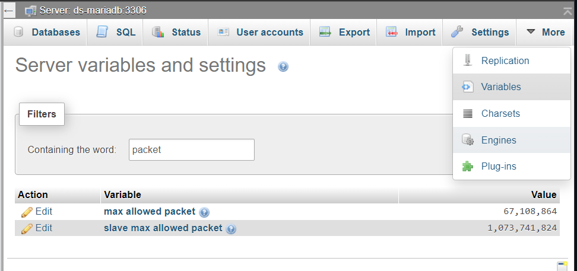

# MariaDB Test

This repo contains test scripts for testing SQLModel integration with MariaDB.

The script `test.py` sets up a SQL Model with different types of fields, which are matched to native MariaDB types, and inserts an entry into the corresponding database table.  The result can be viewed in phpMyAdmin.

> [!WARNING]
> To enable larger files (e.g. `BLOB` or `JSON` columns), the `max_allowed_packet` variable needs to be increased. This can be done in phpMyAdmin as shown below. Note however that sending too large a file can still cause the query to fail, or even crash the database!
>
> 